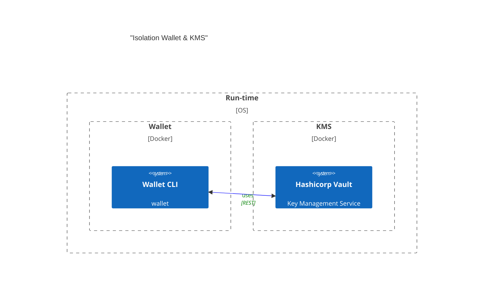

# Vault Wallet

This repo is a demonstration of a wallet that uses Hashicorp Vault as a Key Management Service (KMS) to store and manage cryptographic keys. The wallet is a CLI application that allows users to interact with the wallet and KMS to craft, sign and submit transactions to the Algorand network.

## Why Hashicorp Vault

Managing and securing cryptographic keys is a fundamental requirement for any system and not special to blockchain applications. 
Hashicorp Vault is a popular and widely used KMS that provides a secure and scalable way to manage keys and secrets.

### Natively supports Ed25519 signature scheme

A big advantage of Vault in Algorand application design is that it doesn't require the integration of extra modules to support non-native signature schemes (i.e secp256k1).
Ed25519 is natively supported and Vault's security model is maintained without relying on external modules.

## Transaction Steps
- Craft tx Model
- Encode
- Sign
- Attach Signature
- Re-Encode
- POST

## Conceptual Architecture

This pattern ensure that applications comply with the principle of **ISOLATION** between appliation space and "trusted" space; i.e the KMS.
Most web3 applications handle cryptographic keys in-memory and in the same run-time space as the application. This is a security risk as the keys can be easily compromised by an attacker who gains access to the application's memory space.

This ensures that if the application is compromised, the keys are still secure and cannot be accessed by the attacker.



## Wallet Components
- Local State
- Networking
- KMS
- Data Models
- Encoding
- API

### Algo Models

This project relies on [algo-models](https://www.npmjs.com/package/@algorandfoundation/algo-models) to craft the transaction model.

#### Why not the AlgoSDK? 

The AlgoSDK is a great tool for interacting with the Algorand network. However, the transaction models
used as part of it's API's are not the real "raw" transaction models that are sent to the network. The SDK abstracts some datal model handling, which might look easier for the developer to handle, but
this means that if we want to integrate an agnostic, traditional KMS that doesn't understand how to manipulate the data models, it wouldn't produce valid signatures.

More information about this decision can be found [here](https://github.com/algorandfoundation/algo-models)


## 1. Setup / Boot Vault

```bash
# Install local deps
$ yarn

# Launch Vault
$ docker-compose up -d vault

# Init and unseal Vault
$ yarn run vault:init

# Activate Transit Engine
$ yarn vault:transit
```

## 2. Setup Proper ENVIRONMENT VARIABLES

In `.env` file, change `VAULT_TOKEN` to the root token generated by Vault. You can find this in `vault-seal-keys.json` file.

Changes other variables as needed.

## 3. run Wallet REPL CLI

```bash
yarn run start:dev -- --entryFile repl 
```

It should look something like this:

```bash
[9:47:01 PM] Starting compilation in watch mode...

[9:47:04 PM] Found 0 errors. Watching for file changes.

[Nest] 9936  - 11/21/2024, 9:47:04 PM     LOG [NestFactory] Starting Nest application...
[Nest] 9936  - 11/21/2024, 9:47:04 PM     LOG [InstanceLoader] ChainModule dependencies initialized
[Nest] 9936  - 11/21/2024, 9:47:04 PM     LOG [InstanceLoader] HttpModule dependencies initialized
[Nest] 9936  - 11/21/2024, 9:47:04 PM     LOG [InstanceLoader] ConfigHostModule dependencies initialized
[Nest] 9936  - 11/21/2024, 9:47:04 PM     LOG [InstanceLoader] VaultModule dependencies initialized
[Nest] 9936  - 11/21/2024, 9:47:04 PM     LOG [InstanceLoader] ConfigModule dependencies initialized
[Nest] 9936  - 11/21/2024, 9:47:04 PM     LOG [InstanceLoader] WalletModule dependencies initialized
[Nest] 9936  - 11/21/2024, 9:47:04 PM     LOG REPL initialized
> 

```

If an error message is displayed along side the LOG messages, please check the `.env` file and ensure that the `VAULT_TOKEN` is set correctly and that vault is running. 


## 4. Commands to craft, encode, sign and POST a transaction

Submit each command individually. This is just a demonstration of the steps involved in crafting and sending a transaction.


### Get Wallet Instance
```ts
w = get(Wallet) 

```

### Generate / Get Public Key from Vault and encode it into an Algorand Address
```ts
addr = await w.getAddress() 
```

### Get Transaction Crafter Instance

```ts
crafter = w.craft() 
```

### Craft & Get PAY Transaction

```ts
tx = crafter.pay(100000, addr, addr)
    .addFirstValidRound(46005730) //adjust this value
    .addLastValidRound(46005808) //adjust this value
    .get()
```

### Encode Transaction

```ts
encoded = tx.encode()
```

### Sign encoded payload
    
```ts
sig = await w.sign(encoded)
```

### Attach Signature to Encoded Payload

```ts
ready = crafter.addSignature(encoded, sig)
```

### Submit Transaction

```ts
await w.submitTransaction(ready)
```