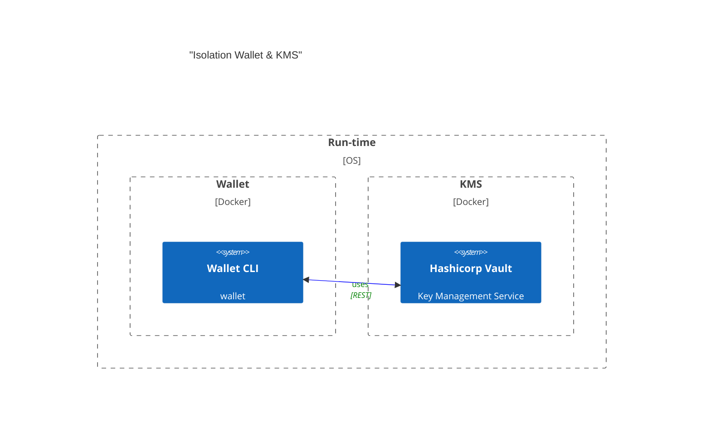

# Vault Wallet

## Transaction Steps
- Craft tx Model
- Encode
- Sign
- Attach Signature
- Re-Encode
- POST

## Conceptual Architecture



## Wallet Components
- Local State
- Networking
- KMS
- Data Models
- Encoding
- API


## 1. Setup / Boot Vault

```bash
# Install local deps
$ yarn

# Launch Vault
$ docker-compose up -d vault

# Init and unseal Vault
$ yarn run vault:init
``` 

## 2. Setup Proper ENVIRONMENT VARIABLES

In `.env` file, change `VAULT_TOKEN` to the root token generated by Vault. You can find this in `vault-seal-keys.json` file.

Changes other variables as needed.

## 3. run Wallet REPL CLI

```bash
yarn run start:dev -- --entryFile repl 
```

It should look something like this:

```bash
[9:47:01 PM] Starting compilation in watch mode...

[9:47:04 PM] Found 0 errors. Watching for file changes.

[Nest] 9936  - 11/21/2024, 9:47:04 PM     LOG [NestFactory] Starting Nest application...
[Nest] 9936  - 11/21/2024, 9:47:04 PM     LOG [InstanceLoader] ChainModule dependencies initialized
[Nest] 9936  - 11/21/2024, 9:47:04 PM     LOG [InstanceLoader] HttpModule dependencies initialized
[Nest] 9936  - 11/21/2024, 9:47:04 PM     LOG [InstanceLoader] ConfigHostModule dependencies initialized
[Nest] 9936  - 11/21/2024, 9:47:04 PM     LOG [InstanceLoader] VaultModule dependencies initialized
[Nest] 9936  - 11/21/2024, 9:47:04 PM     LOG [InstanceLoader] ConfigModule dependencies initialized
[Nest] 9936  - 11/21/2024, 9:47:04 PM     LOG [InstanceLoader] WalletModule dependencies initialized
[Nest] 9936  - 11/21/2024, 9:47:04 PM     LOG REPL initialized
> 

```

If an error message is displayed along side the LOG messages, please check the `.env` file and ensure that the `VAULT_TOKEN` is set correctly and that vault is running. 


## 4. Commands to craft, encode, sign and POST a transaction

```ts
w = get(Wallet)

addr = await w.getAddress()

crafter = w.craft()

tx = crafter.pay(100000, addr, addr).addFirstValidRound(46005730).addLastValidRound(46005808).get()

encoded = tx.encode()

sig = await w.sign(encoded)

ready = crafter.addSignature(encoded, sig)

await w.submitTransaction(ready)
```