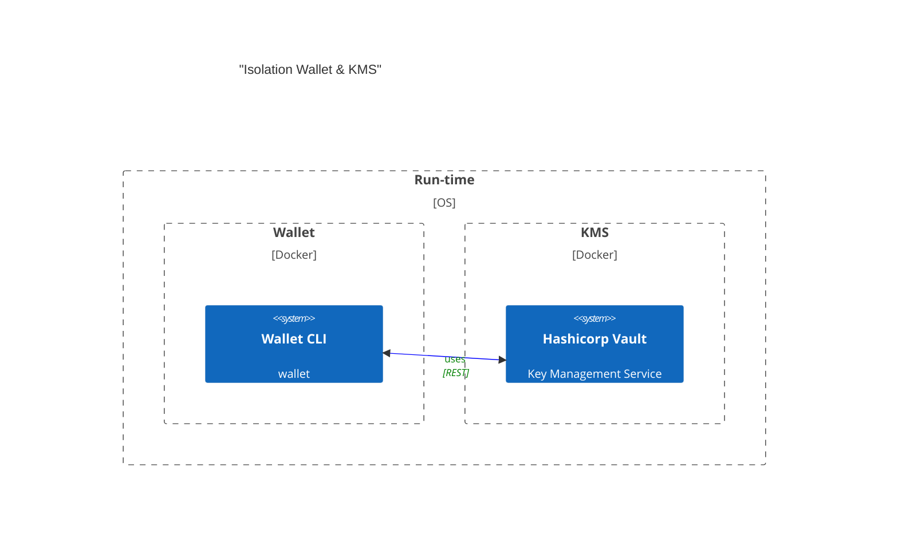

# Vault Wallet

## Transaction Steps
- Craft tx Model
- Encode
- Sign
- Attach Signature
- Re-Encode
- POST

## Conceptual Architecture



## Wallet Components
- Local State
- Networking
- KMS
- Data Models
- Encoding
- API


## How to run

```bash
# Install local deps
$ yarn

# Launch Vault
$ docker-compose up -d vault

# Configure Vault at http://localhost:8200
# Then configure VAULT_TOKEN in .env

# Init and unseal Vault
$ yarn run vault:init

# Run the wallet REPL / CLI
yarn start:dev -- --entryFile repl
``` 
